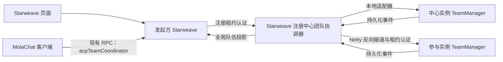

# 注册中心混合队伍改造

目标：MolaChat 不运行时，Starweave 混合队伍仍可完整使用；MolaChat 保留现有交互，删除其全局协调实现。用户会清空重建，不迁移旧数据。

## 边界

- 注册中心实例运行独立团队协调模块，注册目录与 Netty 隧道负责连接。
- 参与实例的 TeamManager 持有本地成员运行时，中心保存全局 placement 与操作进度。
- Starweave owner 与 MolaChat chatterId 保持隔离，共享授权在中心过滤、目标实例再次校验。
- 同一队伍只有一个协调中心，不在中心离线时切换到旧 MolaChat 协调器。
- 实例事件持久化后投递；命令超时不代表失败，不生成新请求 ID 重放。

## 进度

- [x] 实例间团队协议、租约身份验证、中心寻址。
- [x] 全局队伍存储、创建删除补偿、恢复对账。
- [x] TalkTo、队长规则、事件投递与页面投影。
- [x] Starweave 页面接入新协调器，保留普通本地队伍行为。
- [x] MolaChat 接入新协调器并删除原协调代码及存储。
- [x] 两仓库最终回归与打包：Starweave 全量 755 项、MolaChat 相关回归 98 项，均通过；普通/依赖 JAR 与 MolaChat clean 打包完成。
- [x] 两个独立 JVM 的真实 HTTP/Netty 隧道验收；桌面与移动尺寸 Chrome 交互验收。

## 验收

覆盖成员发现和共享授权、设备选择、普通/队长模式、文本附件、流式工具卡片、历史/取消/新建/恢复/记忆整理、TalkTo 与通信限制、断线重连、中心/参与实例重启、失败补偿和删除。测试使用独立临时数据目录。实际部署与源码验证分开报告。

## 调用与职责

全局队伍定义、成员位置、创建/删除进度、补偿和重启对账属于中心。每个参与实例继续负责自身 ACP 客户端、会话、历史、附件和成员命令；原有 TeamManager 与命令校验被复用。

MolaChat 保留本机设备选择、普通本地队伍的现有 RPC 路径、页面投影和交互入口。混合队伍改为向选定本机实例代理一个协调命令，原来的 MixedTeamRecord、MixedTeamStore、跨实例拆分创建、删除补偿、TalkTo 路由和 Starweave 网关回调处理已删除。MolaChat 离线时，其页面事件在发起实例持久化排队，由独立线程恢复投递，不阻塞中心的队伍运行。

## 授权与部署条件

- 共享给 MolaChat chatterId 的 Agent 在该用户选择本机环境后，由中心按同一 chatterId 过滤，仍可发现与选用。参与实例执行时再次检查共享授权。
- Starweave 页面的 owner 是 `starweave-<instanceId>`；共享给 chatterId 不会自动授权给该 owner。使用两种客户端时按需要分别授权。
- 混合队伍需要运行中的注册中心，所有参与实例必须接入同一中心并升级到新协议；纯本地普通队伍不要求注册中心。
- 不处理旧队伍数据迁移，不自动删除用户数据，也不在中心离线时退回 MolaChat 协调。
- 队伍成员更新、远程文件预览等既有未开放边界保持不变，本改造不宣称新增这些能力。

## 验证证据与范围

`RegistryMixedTeamIntegrationTest` 启动两个独立 Starweave JVM，使用生产 REST 路由、生产 TeamManager 与真实 Netty 反向隧道。它覆盖中心本机及远程实例发起的混合队伍、消息/工具事件、附件内容、历史读取、新会话与恢复、TalkTo、参与实例重连、中心重启与完整删除，全程不建立 MolaChat 连接。模型提供者采用确定性测试客户端，不能据此宣称真实模型进程已验收。

真实 Chrome 在 1440×900 和 390×844 下通过现有页面完成本机/远程选人、混合队伍创建、远程聊天和工具卡片展示，未出现 JavaScript 错误。自动化测试目录与数据均为临时目录；生产配置、数据和运行进程未修改。上线仍须更新并重启中心、参与实例，以及需要使用新机制的 MolaChat 服务。

正式依赖 JAR 的 `acp` 启动入口也完成隔离冒烟验证：使用独立数据目录、独立实例注册目录、空 chatterIds 和一个按需开启的本地来源，将 MolaChat 地址设为不可达的测试地址，团队列表接口仍返回成功。未启动真实模型会话。
